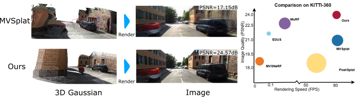

<h1 align="center">EVolSplat: Efficient Volumetric Splatting for Real-Time Urban View Synthesis (CVPR 2025)</h1>

[](https://arxiv.org/pdf/2503.20168)

Sheng Miao, [Jiaxin Huang](https://jaceyhuang.github.io/), Dongfeng Bai, Xu Yan, [Hongyu Zhou](https://hyzhou404.github.io/), [Yue Wang](https://ywang-zju.github.io/), Bingbing Liu, [Andreas Geiger](https://www.cvlibs.net/) and [Yiyi Liao](https://yiyiliao.github.io/) 

Our project page can be seen [here](https://xdimlab.github.io/EVolSplat/).

## :book: Datasets
We evaluate our model on [KITTI-360](http://www.cvlibs.net/datasets/kitti-360/) and [Waymo](https://waymo.com/open/download/). Here we show the structure of a test dataset as follow, similar to the [EDUS](https://xdimlab.github.io/EDUS/). We provide the one example data for inference on KITTI-360, which can be found in huggingface [here](https://huggingface.co/datasets/cookiemiao/EvolSplat/tree/main).


The dataset should have a structure as follows:
```
├── $PATH_TO_YOUR_DATASET
    ├── $SCENE_0
        ├── depth
        ├── pointcloud/*.ply
        ├── *.png
        ...
        ├── transfroms.json
    ...
    ├── SCENE_N
        ├── depth
        ├── pointcloud/*.ply
        ├── *.png
        ...
        ├── transfroms.json
```

## :house: Installation
Our EVolSplat is built on [nerfstudio](https://github.com/nerfstudio-project/nerfstudio). You can follow the nerfstudio webpage to install our code.  


#### Create environment
We recommend using conda to create a new environment and you can find the detailed environment file in `environment.yml`.
```bash
conda create --name EVolSplat -y python=3.8
conda activate EVolSplat
pip install --upgrade pip
```
#### Dependencies
##### Install PyTorch
Install PyTorch with CUDA (this repo has been tested with CUDA 11.8 with torch 2.1.2 and CUDA 11.7 with torch 2.0.1).

For CUDA 11.8 with torch 2.1.2:
```bash
pip install torch==2.1.2+cu118 torchvision==0.16.2+cu118 --extra-index-url https://download.pytorch.org/whl/cu118
conda install -c "nvidia/label/cuda-11.8.0" cuda-toolkit
```

For CUDA 11.7 with torch 2.0.1:
```bash
pip install torch==2.0.1+cu117 torchvision==0.15.2+cu117 --extra-index-url https://download.pytorch.org/whl/cu117
conda install -c "nvidia/label/cuda-11.7.1" cuda-toolkit
```
##### Install TorchSparse
Install the spaseCNN library, we recommend the version 2.1.0. We can find the installation instruction in the [torchsparse](https://github.com/mit-han-lab/torchsparse) repository.
```bash
conda install -c conda-forge sparsehash
sudo apt-get install libsparsehash-dev  
git clone --recursive https://github.com/mit-han-lab/torchsparse
python setup.py install
```
##### Install gsplat
Install [gsplat](https://github.com/nerfstudio-project/gsplat) from source code. We recommend the version >= 1.0.0.
```bash
pip install ninja==1.11.1.1
pip install git+https://github.com/nerfstudio-project/gsplat.git
```
If you meet some problems, you can check the dependencies from `environment.yml`.
#### Install EVolSplat
Install EVolSplat form source code
```bash
git clone https://github.com/XDimLab/EVolSplat.git
cd EVolSplat
pip install --upgrade pip setuptools
pip install -e .
```


## :chart_with_upwards_trend: Evaluation & Checkpoint
We provide the pretrained model trained on `KITTI-360`, you can download the pre-trained models and example data from  [huggingface](https://huggingface.co/datasets/cookiemiao/EvolSplat/tree/main) for a quick start. 

Place the downloaded checkpoints in `checkpoints` folder in order to test it later.

### ✈️ Feed-forward Inference
Replace `$PATH_TO_YOUR_DATASET$` with your data path.
```
python nerfstudio/scripts/infer_zeroshot.py evolsplat \
  --load_dir checkpoints/ \
  --pipeline.model.freeze_volume=True \
  zeronpt-data \
  --data $PATH_TO_YOUR_DATASET$ \
  --kitti=True 
```

##  Training
Generate the training sequences by runing `preprocess/run.py`. 
After preparing the training dataset, we provide the training script to train multiple scenes from scratch. The default sparsity is `Drop50`.
```
ns-train evolsplat --data `$PATH_TO_YOUR_DATASET$`
```
## 📢 News
* 2025-02-27: Accepted by CVPR 2025 !

* 2025-03-26: Project Page and arxiv.

* 2025-06-06: Release dataset preprocess & training code !

## :clipboard: Citation

If our work is useful for your research, please give me a star and consider citing:

```
@inproceedings{miao2025efficient,
  title={EVolSplat: Efficient Volumetric Splatting for Real-Time Urban View Synthesis},
  author={Miao, Sheng and Huang, Jiaxin and Bai, Dongfeng and Yan, Xu and Zhou, Hongyu and Wang, Yue and Liu, Bingbing and Geiger, Andreas and Liao, Yiyi},
  booktitle={IEEE Conference on Computer Vision and Pattern Recognition},
}
```
## :sparkles: Acknowledgement
- This project is based on [nerfstudio](https://github.com/nerfstudio-project/nerfstudio) and [gsplat](https://github.com/nerfstudio-project/gsplat).
- Some codes are brought from [IBRNet](https://github.com/googleinterns/IBRNet) and [SparseNeus](https://github.com/xxlong0/SparseNeuS).